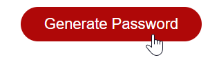
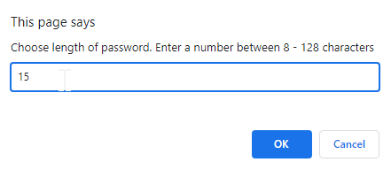
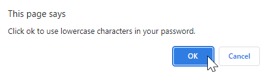
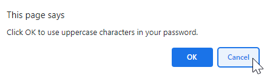
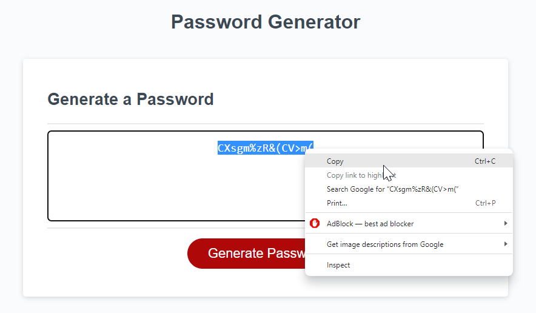

# Password Generator

## Description

Use this application to generate random passwords using 8 - 128 characters, including lowercase, uppercase, numerals, or special characters.  

## Usage
1. Click "Generate Password" button to begin.

2. Choose the number of characters you want included in your password. You must choose a number between 8 - 128 and click 'OK'. 

3. Choose the types of characters you want included in your password by clicking 'OK'. 

If you do not want the charater type included, click 'Cancel'. 

You must choose **at least one** character type to proceed. 

4. Copy your the random password displayed using your chosen criteria. 

## URL
https://kduesler.github.io/Kyle-Password-Generator/